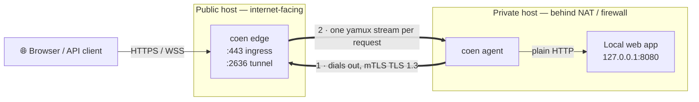
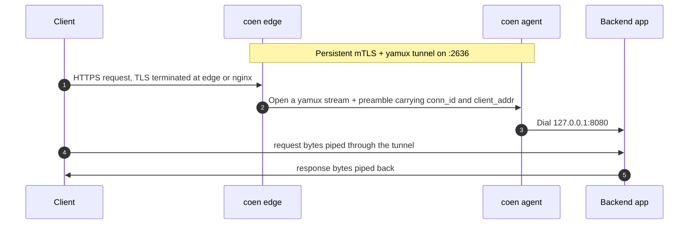
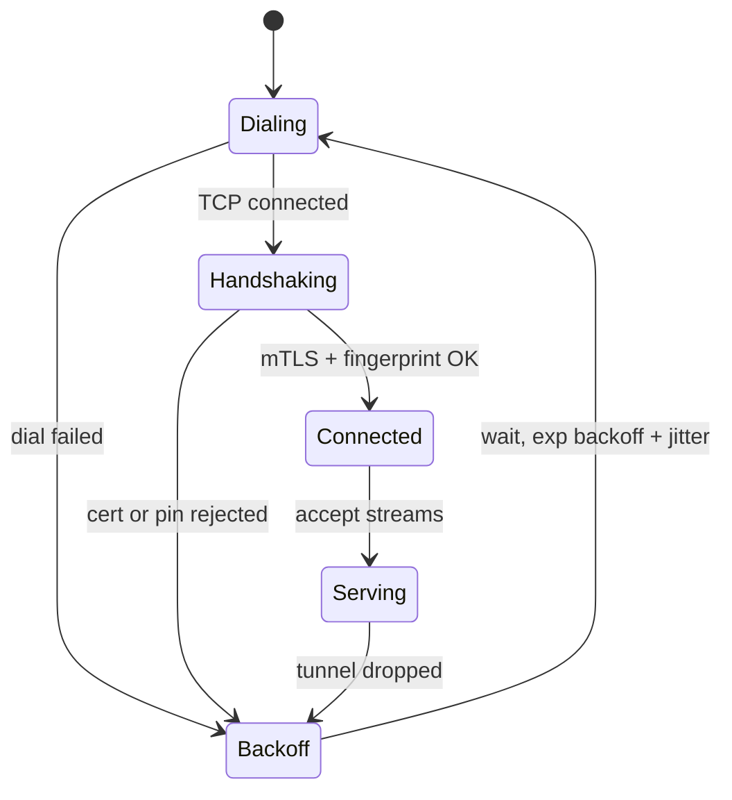
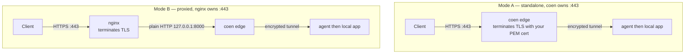

<p align="center">
  
</p>

<p align="center">
  <a href="https://github.com/baspeters/coen/actions/workflows/ci.yml"></a>
  <a href="https://goreportcard.com/report/github.com/baspeters/coen"></a>
  <a href="https://pkg.go.dev/github.com/baspeters/coen"></a>
  <a href="LICENSE"></a>
  
  
</p>

<p align="center">
  <strong>Coen</strong> is a lightweight, fast, self-hosted tunnel that exposes a private web
  service to the internet through a single, always-on, mutually-authenticated (mTLS) tunnel —
  like Cloudflare Tunnel, but you run both ends.
</p>

---

> **Project status — MVP.** The tunnel core (mTLS transport, HTTP/WebSocket forwarding,
> reconnect, diagnostics) is implemented and covered by unit + end-to-end tests. A few
> production-hardening items (public-listener rate/limits, graceful in-flight draining,
> Prometheus metrics, multi-route) are on the [roadmap](#roadmap). Review the
> [security model](#security-model) before exposing an edge to the public internet.

## Table of contents

- [Why Coen?](#why-coen)
- [Features](#features)
- [How it works](#how-it-works)
- [Key concepts](#key-concepts)
- [Installation](#installation)
- [Quick start](#quick-start)
- [Deployment modes](#deployment-modes)
- [Command overview](#command-overview)
- [Configuration reference](#configuration-reference)
- [Security model](#security-model)
- [Observability & diagnostics](#observability--diagnostics)
- [Running as a systemd service](#running-as-a-systemd-service)
- [Roadmap](#roadmap)
- [Contributing](#contributing)
- [Reporting bugs & security issues](#reporting-bugs--security-issues)
- [Project layout](#project-layout)
- [FAQ](#faq)
- [The name](#the-name)
- [Acknowledgements](#acknowledgements)
- [License](#license)

## Why Coen?

You have a web app, API, or dashboard running on a machine that **isn't reachable from the
internet** — it sits behind NAT, a home router, a corporate firewall, or a cloud security
group with no inbound rules. You want to serve it publicly over HTTPS **without** opening
inbound ports, punching holes in firewalls, running a full VPN, or handing your traffic to a
third-party SaaS.

Coen solves this the same way tools like Cloudflare Tunnel and ngrok do — but **entirely
self-hosted**:

- A small **agent** on the private machine dials **outbound** to a public **edge** you
  control and holds one persistent, encrypted connection open (reconnecting automatically).
- The **edge** — on any internet-facing host you own — accepts public HTTPS/WebSocket
  traffic and streams each request back down the tunnel to the agent, which forwards it to
  your local service.

No inbound ports on the private side. No shared secret in a config file. No third party in
the data path. Two static Go binaries and a couple of YAML files.

## Features

- 🔒 **Mutually-authenticated tunnel** — TLS 1.3 with client-certificate auth (mTLS) and an
  Ed25519 CA. Adding or revoking an agent is issuing or removing a certificate; there is no
  shared secret anywhere.
- 🌐 **HTTPS *and* WebSocket** — the edge forwards raw byte streams, so `Upgrade` handshakes
  and long-lived keep-alive connections work with zero special-casing.
- 🧩 **Two ingress modes** — the edge can terminate TLS itself with your PEM certificate, or
  sit behind an existing **nginx** vhost as a plain-HTTP upstream.
- ♻️ **Always-on & self-healing** — the agent reconnects with exponential backoff + jitter;
  yamux keepalives detect dead peers behind NAT.
- 🔭 **First-class diagnostics** — named connectivity-lifecycle logs, a `conn_id` that
  correlates a single request across *both* processes, a `coen doctor` preflight, and a live
  `coen status` admin socket.
- 📦 **Single binary, easy ops** — one `coen` binary with subcommands, YAML config, and a
  `coen install` that drops hardened systemd units.
- 🪶 **Lean** — pure Go, three third-party dependencies (`cobra`, `yamux`, `yaml.v3`),
  everything else standard library.

## How it works



Only the **agent** ever initiates a connection. The edge never needs a route into the
private network — that is what lets Coen work from behind NAT with no inbound ports.

## Key concepts

- **Edge** — the public `coen edge` process. Terminates (or receives, behind nginx) public
  traffic and multiplexes it down the tunnel.
- **Agent** — the private `coen agent` process. Dials the edge, authenticates, and bridges
  each stream to your local service.
- **Tunnel** — one persistent mTLS connection on the signature port **`2636`** (that's `COEN`
  on a phone keypad), carrying many multiplexed
  [yamux](https://github.com/hashicorp/yamux) streams.
- **Stream & preamble** — every public connection becomes one stream, prefixed with a tiny
  preamble carrying a `conn_id` and the original client address so the request can be traced
  end-to-end.

### Request data flow



### Agent connection lifecycle

The agent runs a connect/reconnect loop; a dropped tunnel is always recovered.



### Ingress modes



## Installation

Coen builds to a single static binary. You need **Go 1.25+** to build it; the daemons target
**Linux** (systemd), while the CLI and `coen cert` tooling run anywhere Go does.

**With `go install`:**

```bash
go install github.com/baspeters/coen/cmd/coen@latest
```

**From source:**

```bash
git clone https://github.com/baspeters/coen
cd coen
make build          # -> ./bin/coen
make build-linux    # -> ./bin/coen-linux-amd64  (cross-compile for the server)
```

## Quick start

This walks through a **local, single-machine trial** (edge, agent, and a backend all on
`127.0.0.1`). The two-host production flow is identical — only the addresses and the cert
host change.

**1. Build and create the PKI.** One command creates the CA; two more issue the edge and
agent certificates from it.

```bash
make build
./bin/coen cert init  --dir ./pki
./bin/coen cert edge  --dir ./pki --host 127.0.0.1     # use your public FQDN in production
./bin/coen cert agent --dir ./pki --name my-agent
```

**2. Write two configs.**

```yaml
# edge.yaml — the public side (proxied mode: plain-HTTP ingress, no PEM needed)
ingress:
  mode: proxied
  listen: 127.0.0.1:8000
tunnel:
  listen: 127.0.0.1:2636
  ca:   ./pki/ca.crt
  cert: ./pki/edge.crt
  key:  ./pki/edge.key
admin:
  socket: /tmp/coen-edge.sock
```

```yaml
# agent.yaml — the private side
edge:
  address: 127.0.0.1:2636
  ca:   ./pki/ca.crt
  cert: ./pki/agent.crt
  key:  ./pki/agent.key
service:
  address: 127.0.0.1:9000     # your local app
admin:
  socket: /tmp/coen-agent.sock
```

**3. Start a backend, the edge, and the agent** (three terminals, or background them):

```bash
python3 -m http.server 9000            # stand-in for your private app
./bin/coen edge  --config edge.yaml
./bin/coen agent --config agent.yaml
```

**4. Verify and drive traffic through the tunnel:**

```bash
./bin/coen status --socket /tmp/coen-edge.sock     # -> tunnel: true
curl http://127.0.0.1:8000/                        # served by :9000, via the tunnel
```

**Before you go live in production**, run the preflight on each host — it checks certs,
expiry, DNS, port reachability, a live mTLS handshake, and clock skew:

```bash
coen doctor --role edge  --config /etc/coen/edge.yaml
coen doctor --role agent --config /etc/coen/agent.yaml
```

## Deployment modes

Coen's tunnel side is identical either way; only how the **edge ingests public traffic**
differs.

### Mode A — standalone (Coen terminates TLS)

Set `ingress.mode: standalone`, bind `:443`, and provide your PEM certificate:

```yaml
ingress:
  mode: standalone
  listen: ":443"
  tls:
    cert: /etc/coen/certs/public.crt   # e.g. from Let's Encrypt / certbot
    key:  /etc/coen/certs/public.key
```

### Mode B — behind nginx (nginx terminates TLS)

Set `ingress.mode: proxied` and `ingress.listen: 127.0.0.1:8000`; nginx keeps `:443` and its
certificate. Add the shipped snippet ([`packaging/nginx/coen.conf`](packaging/nginx/coen.conf))
to your vhost — it includes the `map` block needed for clean WebSocket upgrades:

```nginx
map $http_upgrade $connection_upgrade { default upgrade; '' close; }

location / {
    proxy_pass http://127.0.0.1:8000;   # coen edge in proxied mode
    proxy_http_version 1.1;
    proxy_set_header Upgrade $http_upgrade;
    proxy_set_header Connection $connection_upgrade;
    proxy_set_header Host $host;
}
```

Only the tunnel port (`2636`) needs to be reachable by the agent; nginx continues to own
`:443`, and the mTLS tunnel stays end-to-end (nginx never sees the tunnel's certificates).

## Command overview

All functionality lives under one binary, `coen <command>`.

| Command | What it does |
| --- | --- |
| `coen edge` | Run the public edge (ingress + mTLS tunnel server). |
| `coen agent` | Run the private agent (dials the edge, forwards to a local service). |
| `coen cert init` | Create a new Coen CA (`ca.crt`, `ca.key`). |
| `coen cert edge` | Issue the edge (server) certificate, signed by the CA. |
| `coen cert agent` | Issue an agent (client) certificate. |
| `coen doctor` | Role-aware preflight diagnostics with ✓/✗ and remediation hints. |
| `coen status` | Live snapshot from a running daemon over its admin socket. |
| `coen install` | Drop a hardened systemd unit + example config for a role. |
| `coen version` | Print the version. |

<details>
<summary><strong>Flags &amp; examples</strong></summary>

```bash
# PKI (default --dir /etc/coen/pki; use --force to overwrite an existing CA)
coen cert init  --dir /etc/coen/pki
coen cert edge  --dir /etc/coen/pki --host edge.example.com   # FQDN or IP -> cert SAN
coen cert agent --dir /etc/coen/pki --name laptop-agent       # --name -> certificate CN

# Daemons (default --config /etc/coen/<role>.yaml)
coen edge  --config /etc/coen/edge.yaml
coen agent --config /etc/coen/agent.yaml

# Diagnostics
coen doctor --role edge  --config /etc/coen/edge.yaml         # exits non-zero on any ✗
coen status --socket /run/coen/edge.sock                      # add --json for machines

# Packaging
coen install edge  --unit-dir /etc/systemd/system --config-dir /etc/coen --bin /usr/local/bin/coen
```

Sending `SIGHUP` (or `systemctl reload`) reloads a running daemon's config and re-applies its
log level with no restart.

</details>

## Configuration reference

YAML, one file per role. Defaults: `/etc/coen/edge.yaml` and `/etc/coen/agent.yaml`; override
with `--config`. Configs are validated on startup with clear errors.

<details>
<summary><strong><code>edge.yaml</code></strong></summary>

```yaml
ingress:
  mode: standalone          # standalone | proxied
  listen: ":443"            # standalone; use "127.0.0.1:8000" behind nginx
  tls:                      # ignored in proxied mode (nginx owns the cert)
    cert: /etc/coen/certs/public.crt
    key:  /etc/coen/certs/public.key
tunnel:
  listen: ":2636"           # mTLS server the agent dials (Coen signature port)
  ca:   /etc/coen/pki/ca.crt
  cert: /etc/coen/pki/edge.crt
  key:  /etc/coen/pki/edge.key
  # allowed_agent_fingerprints: ["SHA256:…"]   # optional allow-list
log:
  level: info               # trace | debug | info | warn | error
  format: text              # text | json
admin:
  socket: /run/coen/edge.sock
```

</details>

<details>
<summary><strong><code>agent.yaml</code></strong></summary>

```yaml
edge:
  address: edge.example.com:2636
  ca:   /etc/coen/pki/ca.crt
  cert: /etc/coen/pki/agent.crt
  key:  /etc/coen/pki/agent.key
  # edge_fingerprint: "SHA256:…"               # optional certificate pinning
service:
  address: 127.0.0.1:8080   # the local app to expose
reconnect:
  min_backoff: 1s
  max_backoff: 30s
log:
  level: info
  format: text
admin:
  socket: /run/coen/agent.sock
```

</details>

## Security model

- **Transport & auth:** the tunnel is **TLS 1.3** with **mutual certificate authentication**
  (`RequireAndVerifyClientCert`) and an **Ed25519** CA. The edge only accepts agents whose
  client certificate chains to the trusted CA; the agent only trusts an edge whose server
  certificate does the same. There is **no shared symmetric secret** in any config file —
  add an agent by issuing a cert, remove one by revoking/deleting it.
- **Certificate pinning (optional):** the agent can pin the edge's fingerprint
  (`edge_fingerprint`) and the edge can restrict to a set of `allowed_agent_fingerprints`,
  for defence-in-depth beyond CA trust.
- **Least privilege:** the shipped systemd units run as a non-root `coen` user with
  `NoNewPrivileges`, `ProtectSystem=strict`, and a scoped `ReadWritePaths`. A standalone edge
  binding `:443` gets exactly `CAP_NET_BIND_SERVICE` — not full root.
- **Known limitations (MVP):** the public listeners enforce a TLS-handshake deadline on the
  tunnel port, but ingress idle-deadlines / connection caps and bounded in-flight draining on
  shutdown are on the [roadmap](#roadmap). In proxied deployments nginx fronts ingress and
  handles slow-client protection. Treat internet-exposed use as beta, and firewall the tunnel
  port to known sources where you can.

## Observability & diagnostics

Debugging a two-sided tunnel is notoriously hard, so observability is a first-class feature.

- **Named lifecycle logging** (`log/slog`, `text` or `json`): every step is an explicit event
  — `edge.dial`, `tunnel.tls_handshake`, `tunnel.established`, `agent.connected`,
  `ingress.accept`, `stream.open`/`stream.closed`, `reconnect.scheduled`, … — with timing and
  the concrete failure reason on errors.
- **Cross-tunnel correlation:** each request carries a `conn_id` in its stream preamble, so
  the *same* id appears in both the edge and agent logs. `grep <conn_id>` on either host
  reconstructs a request's full lifecycle.
- **`coen status`:** a live snapshot over a local Unix admin socket — tunnel up/since, active
  and total streams, bytes in/out, reconnect count, last error, peer fingerprint (`--json`
  for scripts).
- **`coen doctor`:** role-aware preflight — PKI parse/expiry, DNS, TCP reachability, a live
  mTLS handshake dry-run, local-service reachability, and clock skew — each with a ✓/✗ and a
  remediation hint; exits non-zero if anything fails.
- **Runtime log level:** `systemctl reload` / `SIGHUP` re-reads the config and re-applies the
  level without dropping the tunnel.

## Running as a systemd service

`coen install` writes a hardened unit and an example config for each role:

```bash
sudo coen install edge     # -> /etc/systemd/system/coen-edge.service + /etc/coen/edge.yaml
sudo coen install agent    # -> /etc/systemd/system/coen-agent.service + /etc/coen/agent.yaml

# edit the configs, put your PKI under /etc/coen/pki, then:
sudo systemctl enable --now coen-edge      # on the public host
sudo systemctl enable --now coen-agent     # on the private host
```

## Roadmap

Deliberately out of scope for the MVP, but the architecture leaves room for them:

- [ ] Multi-route / multiple hostnames (host-based routing at the edge)
- [ ] ACME / Let's Encrypt automatic certificates (standalone mode)
- [ ] Prometheus `/metrics` endpoint (counters already tracked internally)
- [ ] Public-listener hardening: ingress idle-deadlines, connection caps, lazy backend dial
- [ ] Bounded graceful draining of in-flight streams on shutdown
- [ ] Tunnelling over `:443` (nginx `stream` + `ssl_preread`, or a WSS transport)
- [ ] Multiple concurrent agents / load balancing; cert rotation & revocation (CRL)
- [ ] QUIC/HTTP-3 transport option

## Contributing

Contributions are very welcome — whether it's a bug fix, a roadmap item, docs, or tests.

1. **Discuss first for anything non-trivial** — open an issue describing the change so we can
   agree on the approach before you invest time.
2. **Fork & branch** from `main` (e.g. `feat/multi-route` or `fix/handshake-deadline`).
3. **Follow TDD** — the codebase is test-first; add or update tests with your change.
4. **Keep it green and tidy** before opening a PR:
   ```bash
   gofmt -l .          # must print nothing
   go vet ./...
   go test -race ./... # the whole suite must pass under the race detector
   ```
5. **Open a pull request** with a clear description of *what* and *why*. Keep PRs focused and
   reference the issue they address. Conventional-commit-style messages
   (`feat:`, `fix:`, `docs:`) are appreciated.

New to the codebase? The [project layout](#project-layout) below is the fastest way in. Good
first contributions: roadmap checkboxes, additional `coen doctor` checks, and broader test
coverage.

## Reporting bugs & security issues

- **Bugs / feature requests:** please [open an issue](https://github.com/baspeters/coen/issues).
  A minimal reproduction, your `coen version`, the relevant `coen doctor` output, and the log
  lines around the failing `conn_id` make fixes dramatically faster.
- **Security vulnerabilities:** please do **not** open a public issue. Report privately via
  GitHub Security Advisories (**Security → Report a vulnerability**) so a fix can ship before
  disclosure.

## Project layout

```
cmd/coen/            # thin main() entrypoint
internal/
  cli/               # cobra commands (edge, agent, cert, doctor, status, install, version)
  edge/              # public server: ingress listeners + tunnel server + stream router
  agent/             # private client: dial/reconnect + stream -> local-service bridge
  tunnel/            # shared mTLS config + yamux sessions + stream preamble
  proxy/             # bidirectional byte-copy plumbing
  pki/               # Ed25519 CA, cert issuance, fingerprints
  config/            # YAML load + validation
  obs/               # slog logging, correlation IDs, live counters
  admin/             # local unix-socket status + control server
  doctor/            # preflight diagnostic checks
  e2e/               # end-to-end tests (HTTP, WebSocket, correlation)
packaging/nginx/     # example proxied-mode vhost snippet
```

## FAQ

**Do I need to open inbound ports on my private machine?** No. The agent only makes an
outbound connection to the edge.

**Does it support WebSockets?** Yes. The edge forwards raw byte streams, so `Upgrade`
handshakes and long-lived sockets pass through transparently.

**Can multiple agents connect to one edge?** The MVP tracks a single active agent per edge;
multi-agent / load balancing is on the roadmap.

**Where do the public TLS certificates come from?** You provide them (e.g. Let's Encrypt) in
standalone mode, or nginx owns them in proxied mode. The Coen CA is *only* for the internal
tunnel mTLS, never for public traffic.

## The name

**Coen** is wordplay on the **Coentunnel**, a road tunnel under the North Sea Canal in
Amsterdam — and, conveniently, `COEN` is `2636` on a phone keypad, which is Coen's signature
tunnel port. Gophers dig tunnels; so does Coen.

## Acknowledgements

- The Go Gopher, created by [Renée French](https://reneefrench.blogspot.com/) (banner art is
  in her style).
- [`hashicorp/yamux`](https://github.com/hashicorp/yamux) for stream multiplexing and
  [`spf13/cobra`](https://github.com/spf13/cobra) for the CLI.

## License

Coen is released under the [MIT License](LICENSE).
