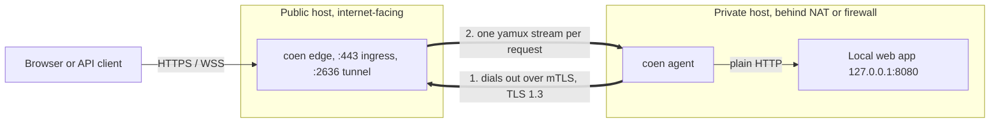
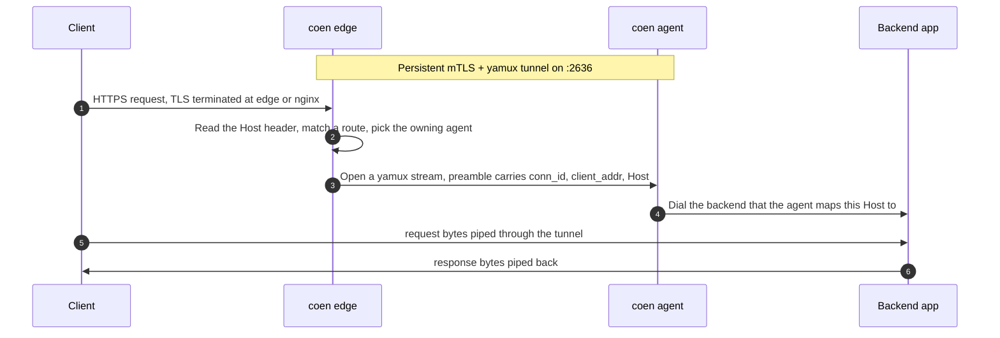
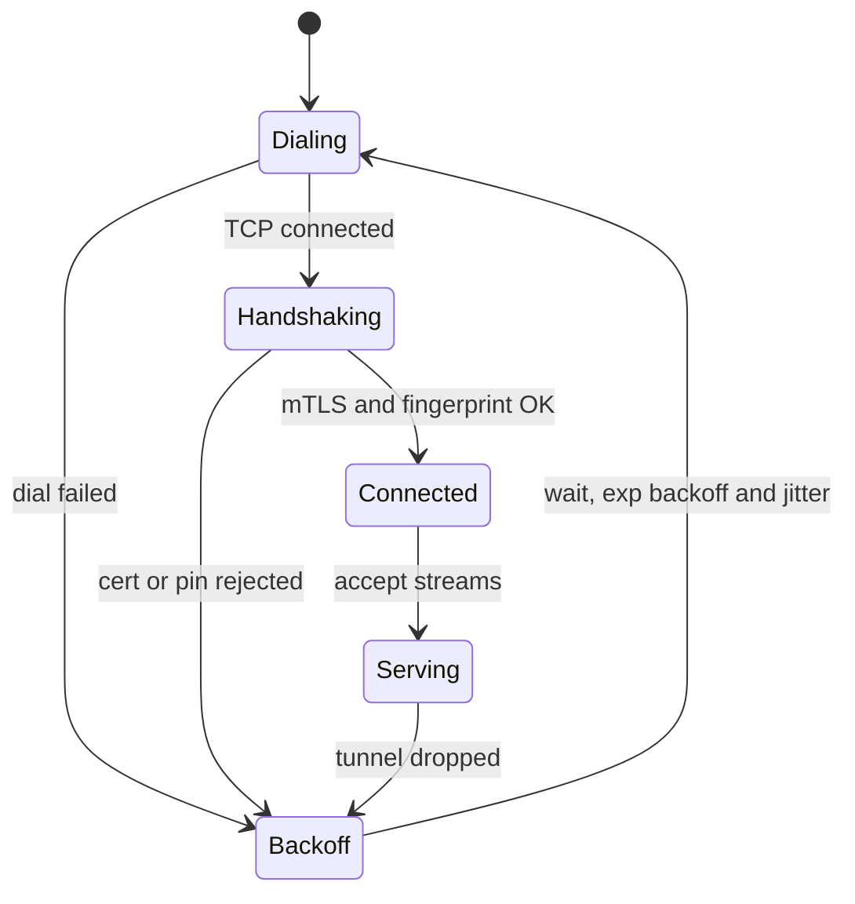
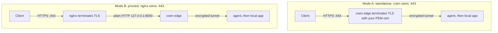

# Coen

[](https://github.com/baspeters/coen/actions/workflows/ci.yml)
[](https://github.com/baspeters/coen/actions/workflows/codeql.yml)
[](https://codecov.io/gh/baspeters/coen)
[](https://github.com/baspeters/coen/releases/latest)
[](https://pkg.go.dev/github.com/baspeters/coen)
[](LICENSE)


Coen is a small, self-hosted tunnel. It publishes one or more private web services to the
internet over always-on, mutually authenticated connections (one per agent). It covers the
same ground as Cloudflare Tunnel or ngrok, except you run both ends and nothing sits between
your traffic and your machines.

> Status: the tunnel core (mTLS transport, HTTP and WebSocket forwarding, reconnect,
> diagnostics) plus multi-agent host-based routing, public-listener limits (connection
> caps, idle deadlines, lazy backend dial), and bounded graceful draining are implemented
> and covered by unit and end-to-end tests. A Prometheus `/metrics` endpoint and ACME
> certificates are still on the [roadmap](#roadmap). Read the [security model](#security-model)
> before you expose an edge to the public internet.

## Table of contents

- [Why Coen](#why-coen)
- [Features](#features)
- [How it works](#how-it-works)
- [Key concepts](#key-concepts)
- [Installation](#installation)
- [Quick start](#quick-start)
- [Deployment modes](#deployment-modes)
- [Examples](#examples)
- [Command overview](#command-overview)
- [Configuration reference](#configuration-reference)
- [Security model](#security-model)
- [Observability and diagnostics](#observability-and-diagnostics)
- [Running as a systemd service](#running-as-a-systemd-service)
- [Roadmap](#roadmap)
- [Contributing](#contributing)
- [Reporting bugs and security issues](#reporting-bugs-and-security-issues)
- [Project layout](#project-layout)
- [FAQ](#faq)
- [The name](#the-name)
- [Acknowledgements](#acknowledgements)
- [License](#license)

## Why Coen

Suppose you run a web app, an API, or a dashboard on a machine that the internet cannot reach:
it lives behind NAT, a home router, a company firewall, or a cloud security group with no
inbound rules. You want to serve it publicly over HTTPS without opening inbound ports or
handing your traffic to someone else's service.

Coen does this with two small binaries:

- An agent on the private machine dials out to a public edge that you control, and keeps one
  encrypted connection open. If it drops, the agent reconnects on its own.
- The edge, on an internet-facing host you own, accepts public HTTPS and WebSocket traffic and
  sends each request back down the tunnel to the agent, which hands it to your local service.

The private side never listens on a public port. There is no shared secret in any config
file, and no third party in the data path.

## Features

- Mutual authentication. The tunnel is TLS 1.3 with client-certificate auth and an Ed25519
  CA. You add or remove an agent by issuing or revoking a certificate; there is no shared
  password to leak.
- Host-based routing across many agents. One edge can front many hostnames and many agents.
  Each hostname is owned by exactly one agent, matched by its client-certificate fingerprint.
  Routes live inline in the config or in `.d` drop-in files.
- HTTPS and WebSocket. The edge reads each request's `Host` header to pick a route, then pipes
  the connection through unchanged, so `Upgrade` handshakes and long-lived sockets work.
- Two ingress modes. The edge can terminate TLS itself with your PEM certificate, or run
  behind an existing nginx vhost as a plain-HTTP upstream.
- Public-listener hardening. Global and per-route connection caps, a request-header read
  timeout, an optional idle deadline, and lazy backend dial (an agent is only reached once a
  complete request head has arrived).
- Graceful shutdown. On SIGINT or SIGTERM the edge and agent stop accepting new work and drain
  in-flight streams up to a configurable timeout before exiting.
- Automatic reconnect. The agent retries with exponential backoff and jitter; yamux
  keepalives notice dead peers behind NAT.
- Diagnostics that actually help. Named connectivity events in the logs, a `conn_id` that ties
  a single request together across both processes, a `coen doctor` preflight, and a live
  `coen status` socket.
- Simple to operate. One binary with subcommands, YAML config, and a `coen install` that
  writes hardened systemd units.
- Small footprint. Pure Go with three third-party dependencies (`cobra`, `yamux`, `yaml.v3`);
  everything else is the standard library.

## How it works



Only the agent opens a connection. The edge never needs a route into the private network,
which is what lets Coen work from behind NAT without any inbound ports.

## Key concepts

- Edge: the public `coen edge` process. It terminates (or, behind nginx, receives) public
  traffic, reads each request's `Host` header, and routes it to the agent that owns that
  hostname.
- Agent: the private `coen agent` process. It dials the edge, authenticates, and bridges each
  stream to the local service matched by the request's `Host`.
- Route: a `host` pattern paired with a target. On the edge the target is the owning agent (by
  client-certificate fingerprint); on the agent it is a local backend address. Matching is
  exact, then wildcard (`*.suffix`), then a default (`*`).
- Tunnel: each agent keeps one persistent mTLS connection to port `2636` (`COEN` on a phone
  keypad), carrying many multiplexed [yamux](https://github.com/hashicorp/yamux) streams.
- Stream and preamble: every public connection becomes one stream, prefixed with a short
  preamble that carries a `conn_id`, the original client address, and the request `Host`, so a
  request can be routed by the agent and traced end to end.

### Request data flow



### Agent connection lifecycle

The agent runs a connect and reconnect loop, so a dropped tunnel always recovers.



### Ingress modes



## Installation

Coen is a single static binary. The daemons target Linux (systemd); the CLI and the
`coen cert` tooling run anywhere Go does.

### From a release (prebuilt binary)

Download the archive for your OS and architecture from the
[latest release](https://github.com/baspeters/coen/releases/latest). Assets are named
`coen_<version>_<os>_<arch>.tar.gz` (linux/darwin, amd64/arm64), with a `checksums.txt`
alongside for verification. Extract and put `coen` on your PATH:

```bash
tar -xzf coen_*_linux_amd64.tar.gz coen
sudo install coen /usr/local/bin/coen
coen version
```

### Linux packages (.deb, .rpm, .apk)

Every release also ships native packages for amd64 and arm64. They install the
binary to `/usr/bin/coen`, add systemd units for both roles under
`/usr/lib/systemd/system`, create a dedicated `coen` service user, and lay down
example configs plus the `edge.d/` and `agent.d/` route drop-in directories in
`/etc/coen` (configs preserved across upgrades). Download the file
for your distribution from the
[latest release](https://github.com/baspeters/coen/releases/latest):

```bash
# Debian, Ubuntu
sudo dpkg -i coen_*_linux_amd64.deb

# Fedora, RHEL, openSUSE
sudo rpm -i coen_*_linux_amd64.rpm

# Alpine
sudo apk add --allow-untrusted coen_*_linux_amd64.apk
```

The services are installed but not started. Edit the config for your role, put
the certificates under `/etc/coen` (see [Quick start](#quick-start)), then
enable the unit:

```bash
sudo systemctl enable --now coen-edge     # or coen-agent
```

### With `go install`

Requires Go 1.25 or newer:

```bash
go install github.com/baspeters/coen/cmd/coen@latest
```

### From source

```bash
git clone https://github.com/baspeters/coen
cd coen
make build          # produces ./bin/coen
make build-linux    # produces ./bin/coen-linux-amd64 for the server
```

## Quick start

The steps below run a full trial on one machine, with the edge, agent, and a backend all on
`127.0.0.1`. A two-host deployment is the same; only the addresses and the certificate host
change.

First, build and create the PKI. One command creates the CA, two more issue the edge and agent
certificates from it.

```bash
make build
./bin/coen cert init  --dir ./pki
./bin/coen cert edge  --dir ./pki --host 127.0.0.1     # use your public FQDN in production
./bin/coen cert agent --dir ./pki --name my-agent
```

Next, write two config files.

```yaml
# edge.yaml, the public side. Proxied mode takes plain HTTP, so no PEM is needed here.
ingress:
  mode: proxied
  listen: 127.0.0.1:8000
tunnel:
  listen: 127.0.0.1:2636
  ca:   ./pki/ca.crt
  cert: ./pki/edge.crt
  key:  ./pki/edge.key
routes:
  - host: "*"                   # catch-all for the trial (see Configuration reference)
    agent_fingerprint: "<my-agent's fingerprint>"   # printed by `coen cert agent`
admin:
  socket: /tmp/coen-edge.sock
```

```yaml
# agent.yaml, the private side.
edge:
  address: 127.0.0.1:2636
  ca:   ./pki/ca.crt
  cert: ./pki/agent.crt
  key:  ./pki/agent.key
routes:
  - host: "*"
    service: 127.0.0.1:9000     # your local app
admin:
  socket: /tmp/coen-agent.sock
```

Start a backend, the edge, and the agent, either in three terminals or in the background.

```bash
python3 -m http.server 9000            # stand-in for your private app
./bin/coen edge  --config edge.yaml
./bin/coen agent --config agent.yaml
```

Check the tunnel and send a request through it.

```bash
./bin/coen status --socket /tmp/coen-edge.sock     # reports tunnel: true
curl http://127.0.0.1:8000/                        # served by :9000, through the tunnel
```

Before going live, run the preflight on each host. It checks certificates, expiry, DNS, port
reachability, a live mTLS handshake, and clock skew.

```bash
coen doctor --role edge  --config /etc/coen/edge.yaml
coen doctor --role agent --config /etc/coen/agent.yaml
```

## Deployment modes

The tunnel side is identical either way. What changes is how the edge takes in public traffic.

### Mode A: standalone, Coen terminates TLS

Set `ingress.mode: standalone`, bind `:443`, and point Coen at your PEM certificate.

```yaml
ingress:
  mode: standalone
  listen: ":443"
  tls:
    cert: /etc/coen/certs/public.crt   # for example, from Let's Encrypt or certbot
    key:  /etc/coen/certs/public.key
```

### Mode B: behind nginx, nginx terminates TLS

Set `ingress.mode: proxied` and `ingress.listen: 127.0.0.1:8000`. nginx keeps `:443` and its
certificate. Add the snippet from [`packaging/nginx/coen.conf`](packaging/nginx/coen.conf) to
your vhost. It includes the `map` block that WebSocket upgrades need.

```nginx
map $http_upgrade $connection_upgrade { default upgrade; '' close; }

location / {
    proxy_pass http://127.0.0.1:8000;   # coen edge in proxied mode
    proxy_http_version 1.1;
    proxy_set_header Upgrade $http_upgrade;
    proxy_set_header Connection $connection_upgrade;
    proxy_set_header Host $host;
}
```

Only the tunnel port (`2636`) needs to be reachable by the agent. nginx keeps `:443`, and the
mTLS tunnel stays end to end, since nginx never sees the tunnel's certificates.

## Examples

The [`examples/`](examples/) directory has an example configuration for every setup variant and
config option, each with its own README:

| Example | Shows |
| --- | --- |
| [standalone, single host](examples/01-standalone-single-host/) | the smallest one-host tunnel |
| [proxied behind nginx](examples/02-proxied-nginx/) | coen behind an existing nginx vhost |
| [multiple routes, one agent](examples/03-multi-route-one-agent/) | one agent fronting several hosts/backends |
| [multiple agents, host-based](examples/04-multi-agent-host-based/) | two agents owning distinct hosts, via `edge.d/` drop-ins |
| [wildcard and default](examples/05-wildcard-and-default/) | `*.example.com` + `*` catch-all matching |
| [hardening and limits](examples/06-hardening-and-limits/) | connection caps, idle deadline, per-route caps, draining |
| [proxied multi-host TLS](examples/07-proxied-multi-host-tls/) | nginx SNI + per-host certs in front of a multi-agent edge |

## Command overview

Everything lives under one binary, invoked as `coen <command>`.

| Command | What it does |
| --- | --- |
| `coen edge` | Run the public edge (ingress plus the mTLS tunnel server). |
| `coen agent` | Run the private agent (dials the edge, forwards to a local service). |
| `coen cert init` | Create a new Coen CA (`ca.crt`, `ca.key`). |
| `coen cert edge` | Issue the edge (server) certificate, signed by the CA. |
| `coen cert agent` | Issue an agent (client) certificate. |
| `coen doctor` | Role-aware preflight checks with pass/fail results and remediation hints. |
| `coen status` | Live snapshot from a running daemon over its admin socket. |
| `coen install` | Write a hardened systemd unit and an example config for a role. |
| `coen version` | Print the version. |

Flags and examples:

```bash
# PKI. Default --dir is /etc/coen/pki; --force overwrites an existing CA.
coen cert init  --dir /etc/coen/pki
coen cert edge  --dir /etc/coen/pki --host edge.example.com   # FQDN or IP goes into the cert SAN
coen cert agent --dir /etc/coen/pki --name laptop-agent       # --name becomes the certificate CN

# Daemons. Default --config is /etc/coen/<role>.yaml.
coen edge  --config /etc/coen/edge.yaml
coen agent --config /etc/coen/agent.yaml

# Diagnostics.
coen doctor --role edge  --config /etc/coen/edge.yaml         # exits non-zero if any check fails
coen status --socket /run/coen/edge.sock                      # add --json for scripts

# Packaging.
coen install edge  --unit-dir /etc/systemd/system --config-dir /etc/coen --bin /usr/local/bin/coen
```

Sending `SIGHUP`, or running `systemctl reload`, re-reads a running daemon's config and
hot-applies the `log.level` without a restart. Other changes (routes, listeners, caps,
timeouts, fingerprints) are read at startup and take effect only when the process restarts.

## Configuration reference

### The config system

- **One file per role.** The edge reads `edge.yaml`, the agent reads `agent.yaml`. The
  defaults are `/etc/coen/edge.yaml` and `/etc/coen/agent.yaml`; override either with
  `--config <path>`.
- **Format.** YAML (`gopkg.in/yaml.v3`). Unknown keys in the base file are ignored; unknown
  keys in a drop-in file are rejected (see below).
- **Durations** are Go duration strings: `500ms`, `10s`, `2m`, `1h`. Every field whose name
  ends in `_timeout` or `_backoff` takes one.
- **Validation at startup.** The daemon refuses to start on an invalid config and prints the
  offending field. It checks the ingress mode, the required paths and addresses, that there is
  at least one route, that every `host` pattern is well formed, and that no host is defined
  twice. `coen doctor` goes further at runtime (file presence, certificate expiry, DNS,
  reachability, a live mTLS handshake, clock skew, and each route's backend).
- **Reload.** `SIGHUP` (or `systemctl reload`) re-reads the file and hot-applies `log.level`
  only. Routes, listeners, caps, timeouts, and fingerprints are read at startup and change
  only on restart.
- **Drop-in route files (`.d`).** Routes may live inline under `routes:` and/or in a
  `<name>.d/` directory next to the config file: `edge.yaml` uses `edge.d/`, `agent.yaml` uses
  `agent.d/`. Each drop-in is a routes-only fragment (a top-level `routes:` list and nothing
  else; any other key is an error). Files are read in sorted filename order and their routes
  appended to the inline `routes`. A host defined twice, whether across two drop-ins or between
  a drop-in and the base file, is a load error that names both sources. The directory is
  optional; when absent, only the inline `routes` are used. Drop-ins suit one file per
  agent or team, and config-managed deployments.

  ```
  /etc/coen/
    edge.yaml          # base config, may carry inline routes
    edge.d/            # optional; merged in sorted order
      team-a.yaml      #   routes: [ { host: app.example.com, agent_fingerprint: "..." } ]
      team-b.yaml      #   routes: [ { host: api.example.com, agent_fingerprint: "..." } ]
  ```

### Log formats

- `text` (logfmt) and `json` are machine-readable and self-contained (each line
  carries its own timestamp and level).
- `journal` is for systemd/journald: it omits the timestamp (journald adds one),
  encodes the level as a syslog priority so `journalctl -p` filters work, and
  renders each event as a short phrase followed by comma-separated fields, for
  example `stream closed, conn_id=..., host=tweake.rs, bytes_in=355`. In this
  format the dotted event ids (`stream.closed`) render as words (`stream closed`);
  `text` and `json` keep the dotted id.
- When `log.format` is unset, coen autodetects: `journal` when its output is
  connected to the journal, otherwise `text`. Set the value explicitly to force
  one (for example `text` to debug a service in a terminal).

### Edge configuration (`edge.yaml`)

```yaml
ingress:
  mode: standalone          # standalone or proxied
  listen: ":443"            # standalone; use "127.0.0.1:8000" behind nginx
  tls:                      # ignored in proxied mode, where nginx owns the cert
    cert: /etc/coen/certs/public.crt
    key:  /etc/coen/certs/public.key
  max_connections: 0        # global cap on concurrent ingress conns; 0 = unlimited
  read_header_timeout: 10s  # bound on reading the HTTP request head; default 10s
  idle_timeout: 0           # rolling idle deadline while streaming; 0 = disabled
tunnel:
  listen: ":2636"           # mTLS server the agent dials
  ca:   /etc/coen/pki/ca.crt
  cert: /etc/coen/pki/edge.crt
  key:  /etc/coen/pki/edge.key
routes:                     # host -> owning agent (by client-cert fingerprint)
  - host: app.example.com   # exact, "*.example.com" wildcard, or "*" default
    agent_fingerprint: "SHA256:..."
    max_connections: 0      # optional per-route cap; 0 = unlimited
drain_timeout: 15s          # finish in-flight streams up to this long on shutdown
log:
  level: info               # trace, debug, info, warn, or error
  # format:                 # unset autodetects (journal under systemd, text otherwise); text|json|journal
admin:
  socket: /run/coen/edge.sock
```

| Key | Type | Default | Description |
| --- | --- | --- | --- |
| `ingress.mode` | string | required | `standalone` (the edge terminates public TLS) or `proxied` (nginx terminates TLS and the edge receives plain HTTP). |
| `ingress.listen` | string | required | Public ingress address, `host:port`. `:443` in standalone, `127.0.0.1:8000` behind nginx. |
| `ingress.tls.cert`, `ingress.tls.key` | path | required in `standalone` | PEM certificate and key for public TLS. Unused in `proxied` mode. |
| `ingress.max_connections` | int | `0` | Global cap on concurrent ingress connections; over it the edge returns `503`. `0` means unlimited. |
| `ingress.read_header_timeout` | duration | `10s` | Deadline for reading a request head (slow-loris protection). `0` disables it. |
| `ingress.idle_timeout` | duration | `0` | Rolling idle deadline while streaming: a connection with no bytes in either direction for this long is closed. `0` disables it. See the WebSocket note below. |
| `tunnel.listen` | string | required | Address of the mTLS tunnel server the agents dial, e.g. `:2636`. |
| `tunnel.ca` | path | required | CA bundle that an agent's client certificate must chain to. |
| `tunnel.cert`, `tunnel.key` | path | required | The edge's server certificate and key for the tunnel. |
| `routes` | list | at least one | Host ownership; see [Host routing](#host-routing-and-matching). May be split into `edge.d/`. |
| `routes[].host` | string | required | Match pattern: an exact host, a `*.suffix` wildcard, or `*` (default). |
| `routes[].agent_fingerprint` | string | required | `SHA256:...` fingerprint of the agent that owns this host; `coen cert agent` prints it. The set of these values is the connection allowlist. |
| `routes[].max_connections` | int | `0` | Per-route cap on concurrent connections; over it the edge returns `503`. `0` means unlimited. |
| `drain_timeout` | duration | `15s` | On shutdown, finish in-flight streams for up to this long before force-closing. `0` closes immediately. |
| `log.level` | string | `info` | `trace`, `debug`, `info`, `warn`, or `error`. |
| `log.format` | string | autodetect | `text`, `json`, or `journal`. Unset autodetects: `journal` under systemd (journald), otherwise `text`. See [Log formats](#log-formats). |
| `admin.socket` | path | (unset) | Unix socket for `coen status`. When unset, the status socket is disabled. |

### Agent configuration (`agent.yaml`)

```yaml
edge:
  address: edge.example.com:2636
  ca:   /etc/coen/pki/ca.crt
  cert: /etc/coen/pki/agent.crt
  key:  /etc/coen/pki/agent.key
  # edge_fingerprint: "SHA256:..."               # optional certificate pinning
routes:                     # host -> local backend service
  - host: app.example.com
    service: 127.0.0.1:8080
reconnect:
  min_backoff: 1s
  max_backoff: 30s
drain_timeout: 15s          # finish in-flight streams up to this long on shutdown
log:
  level: info
  # format:                 # unset autodetects (journal under systemd, text otherwise); text|json|journal
admin:
  socket: /run/coen/agent.sock
```

| Key | Type | Default | Description |
| --- | --- | --- | --- |
| `edge.address` | string | required | `host:port` of the edge tunnel. The host part must match a name in the edge's server certificate. |
| `edge.ca` | path | required | CA bundle the edge's server certificate must chain to. |
| `edge.cert`, `edge.key` | path | required | The agent's client certificate and key. |
| `edge.edge_fingerprint` | string | (unset) | Optional pin. When set, the agent refuses an edge whose server-certificate fingerprint differs. |
| `routes` | list | at least one | Host to local backend; see [Host routing](#host-routing-and-matching). May be split into `agent.d/`. |
| `routes[].host` | string | required | Same pattern grammar as the edge: exact, `*.suffix`, or `*`. |
| `routes[].service` | string | required | Local backend address (`host:port`) the agent dials for this host. |
| `reconnect.min_backoff` | duration | `1s` | Initial reconnect backoff. |
| `reconnect.max_backoff` | duration | `30s` | Maximum reconnect backoff (exponential, with jitter). |
| `drain_timeout` | duration | `15s` | On shutdown, finish in-flight streams for up to this long. `0` closes immediately. |
| `log.level` | string | `info` | `trace`, `debug`, `info`, `warn`, or `error`. |
| `log.format` | string | autodetect | `text`, `json`, or `journal`. Unset autodetects: `journal` under systemd (journald), otherwise `text`. See [Log formats](#log-formats). |
| `admin.socket` | path | (unset) | Unix socket for `coen status`. When unset, the status socket is disabled. |

Host patterns appear on both ends: the edge authorizes which agent owns a host, and the agent
maps the same host to a backend.

### Host routing and matching

The edge reads the HTTP `Host` header of each ingress connection (both modes see cleartext
HTTP/1.x), lowercases it, and strips any port before matching it against the route table.
Precedence is:

1. **Exact** host (`app.example.com`).
2. **Wildcard** `*.suffix` (`*.example.com` matches `a.example.com` and `a.b.example.com`); the
   most specific match, that is the longest suffix, wins.
3. **Default** `*`, if present, matches anything else.

The matched edge route names the owning agent's fingerprint. The edge finds that agent's live
session, opens a stream, and forwards the request with the `Host` in the preamble; the agent
matches the same `Host` against its own `routes` and dials the backend. Both ends must agree on
the host patterns.

The edge answers with a plain HTTP status when it cannot forward:

| Code | Meaning |
| --- | --- |
| `400` | The request head was malformed, missing a `Host`, oversized, or not sent before `read_header_timeout`. |
| `404` | No route matched the `Host`. |
| `502` | A route matched but its agent is offline, a tunnel stream could not be opened, or the agent could not reach its backend. |
| `503` | A global or per-route connection cap was reached. |

When the agent itself cannot reach a backend (the local service is down, or the agent has no
route for the host), it writes a `502` back through the tunnel, so the client gets a proper
error rather than a dropped connection. The failure is logged on the agent with the request's
`conn_id`.

### Listener hardening (edge)

- `ingress.max_connections` and `routes[].max_connections` cap concurrent connections globally
  and per route; over a cap the edge returns `503` without touching an agent.
- `ingress.read_header_timeout` (default `10s`, always on unless `0`) bounds how long a client
  may take to send its request head.
- `ingress.idle_timeout` (default off) closes a streaming connection after that long with no
  bytes in either direction. It is off by default because it would drop an idle but healthy
  WebSocket; set it comfortably above your keepalive interval, or leave it `0`.
- **Lazy backend dial** is inherent, not a knob: the edge opens a tunnel stream (and so the
  agent dials the backend) only after a complete, valid request head has arrived. Connections
  that connect and idle, or send garbage, never reach an agent or backend.

### Graceful draining

On `SIGINT` or `SIGTERM`, the edge stops accepting new ingress connections and the agent stops
accepting new streams; both then wait up to `drain_timeout` for in-flight streams to finish
before force-closing and exiting. A `drain_timeout` of `0` closes everything immediately.

See [`examples/`](examples/) for an example configuration of each variant.

## Security model

The tunnel uses TLS 1.3 with mutual certificate authentication (`RequireAndVerifyClientCert`)
and an Ed25519 CA. The edge accepts only agents whose client certificate chains to the trusted
CA, and the agent trusts only an edge whose server certificate does the same. No config file
holds a shared symmetric secret. To add an agent, issue a certificate; to remove one, revoke
or delete it.

For defence in depth beyond CA trust, the agent can pin the edge's fingerprint
(`edge_fingerprint`), and host ownership at the edge is authoritative: each
`routes` entry names the agent fingerprint that owns a hostname, and the set of
those fingerprints is the connection allowlist. An agent whose fingerprint owns
no route is refused, and an agent cannot serve a hostname it was not granted.

A fingerprint has at most one live session. A second connection presenting the
same certificate, whether a health probe such as `coen doctor --role agent` or a
duplicate certificate on two hosts, is refused without disturbing the serving
agent; a genuine reconnect still works, because the previous session is already
gone by the time the agent redials.

Because the edge routes on the HTTP `Host` header, it parses the request head of
each ingress connection (in both standalone and proxied modes it sees cleartext
HTTP/1.x). This means the edge serves HTTP and WebSocket traffic, not arbitrary
raw TCP; HTTP/2 at the edge is out of scope (the standalone listener does not
advertise `h2`, so clients use HTTP/1.1).

The systemd units ship with least privilege in mind. They run as a non-root `coen` user with
`NoNewPrivileges`, `ProtectSystem=strict`, and a scoped `ReadWritePaths`. A standalone edge
that binds `:443` gets exactly `CAP_NET_BIND_SERVICE`, not full root.

The public listener has several protections you configure under `ingress` (see the
[configuration reference](#listener-hardening-edge)): a TLS-handshake deadline on the tunnel
port, a request-header read deadline, an optional idle deadline, global and per-route
connection caps, and lazy backend dial so a connection reaches an agent only after sending a
complete request head. On shutdown, in-flight streams are drained up to `drain_timeout`. In a
proxied deployment nginx also fronts the ingress and adds its own slow-client protection.
Treat internet-exposed use as beta, and where you can, firewall the tunnel port to known
sources.

## Observability and diagnostics

A two-sided tunnel is awkward to debug, so observability is built into the core rather than
bolted on.

Logging uses `log/slog` in text, JSON, or a journald-friendly `journal` format (see [Log formats](#log-formats)). Each step is a named event, for example `edge.dial`,
`tunnel.tls_handshake`, `tunnel.established`, `agent.connected`, `ingress.accept`,
`stream.open`, `stream.closed`, and `reconnect.scheduled`, with timing and the concrete reason
on failure.

Because every request carries a `conn_id` in its stream preamble, the same id shows up in both
the edge and agent logs. Running `grep <conn_id>` on either host reconstructs one request's
whole lifecycle.

`coen status` returns a live snapshot over a local Unix socket: active and total streams,
bytes in and out, reconnect count, last error, and handshake counts. On the edge it lists the
connected agents with their fingerprints and connect times; on the agent it shows whether the
tunnel is up and since when. Add `--json` for scripts. If `admin.socket` is unset, the status
socket is disabled.

`coen doctor` runs the role-aware preflight described above and exits non-zero if anything
fails, so it fits into deploy scripts. Its agent-side mTLS check is safe to run against a live
agent: the edge keeps the serving session and refuses the probe. Only the `log.level` can be
changed on a running daemon (with `systemctl reload` or `SIGHUP`); other changes need a
restart.

## Running as a systemd service

`coen install` writes a hardened unit and an example config for each role.

```bash
sudo coen install edge     # writes /etc/systemd/system/coen-edge.service and /etc/coen/edge.yaml
sudo coen install agent    # writes /etc/systemd/system/coen-agent.service and /etc/coen/agent.yaml

# Edit the configs, put your PKI under /etc/coen/pki, then enable the service.
sudo systemctl enable --now coen-edge      # on the public host
sudo systemctl enable --now coen-agent     # on the private host
```

The systemd unit runs as a dedicated non-root `coen` user. `coen install` does
not create it (that would mutate system accounts); if it is missing, install
prints the exact `groupadd`/`useradd` commands to create it. The `.deb`, `.rpm`,
and `.apk` packages create the user for you.

## Roadmap

Delivered:

- [x] Multi-route and multiple hostnames (host-based routing at the edge, across multiple agents)
- [x] Public-listener hardening: ingress idle-deadlines, connection caps, lazy backend dial
- [x] Bounded graceful draining of in-flight streams on shutdown

Still planned (the architecture leaves room for them):

- [ ] ACME and Let's Encrypt automatic certificates for standalone mode
- [ ] Prometheus `/metrics` endpoint (the counters are already tracked internally)
- [ ] Tunnelling over `:443` (nginx `stream` with `ssl_preread`, or a WebSocket transport)
- [ ] Load balancing (multiple agents serving the same host); certificate rotation and revocation
- [ ] QUIC and HTTP/3 transport option

## Contributing

Contributions are welcome, whether it is a bug fix, a roadmap item, docs, or tests.

1. For anything non-trivial, open an issue first so we can agree on the approach before you
   spend time on it.
2. Fork and branch from `main`, for example `feat/multi-route` or `fix/handshake-deadline`.
3. The codebase is test-first, so add or update tests alongside your change.
4. Keep it green and tidy before opening a pull request:

   ```bash
   golangci-lint run ./...   # errcheck, staticcheck, govet, ineffassign, unused, gofmt
   go test -race ./...       # the whole suite passes under the race detector
   govulncheck ./...         # scan for known vulnerabilities
   ```

   CI runs the same checks (lint, a Go 1.25 and 1.26 test matrix under `-race`,
   and `govulncheck`) on every push and pull request.

5. Open a pull request that explains what changed and why. Keep it focused, and reference the
   issue it addresses. Conventional-commit-style messages (`feat:`, `fix:`, `docs:`) are
   appreciated.

If you are new to the code, the [project layout](#project-layout) is the fastest way in. Good
first changes include roadmap items, extra `coen doctor` checks, and wider test coverage.

## Reporting bugs and security issues

For bugs and feature requests, [open an issue](https://github.com/baspeters/coen/issues). A
minimal reproduction, your `coen version`, the relevant `coen doctor` output, and the log lines
around the failing `conn_id` make a fix much faster.

For security vulnerabilities, please do not open a public issue. Report it privately through
GitHub Security Advisories (Security, then "Report a vulnerability") so a fix can ship before
disclosure.

## Project layout

```
cmd/coen/            thin main() entrypoint
internal/
  cli/               cobra commands (edge, agent, cert, doctor, status, install, version)
  edge/              public server: ingress listeners, tunnel server, session registry,
                     host router, connection caps, graceful draining
  agent/             private client: dial and reconnect, per-host stream-to-backend bridge
  route/             host-pattern matcher (exact > wildcard > default), shared by edge/agent
  tunnel/            shared mTLS config, yamux sessions, stream preamble
  proxy/             byte-copy plumbing, idle-deadline and prefix conn wrappers
  pki/               Ed25519 CA, certificate issuance, fingerprints
  config/            YAML load, .d drop-in merge, and validation
  obs/               slog logging, correlation IDs, live counters
  admin/             local unix-socket status and control server
  doctor/            preflight diagnostic checks
  e2e/               end-to-end tests (HTTP, WebSocket, correlation, host routing)
examples/            example configs for each setup variant and config option
packaging/nginx/     example proxied-mode vhost snippet
```

## FAQ

Do I need to open inbound ports on the private machine? No. The agent only makes an outbound
connection to the edge.

Does it support WebSockets? Yes. The edge reads a request's `Host` header to route it, then
pipes the connection through unchanged, so `Upgrade` handshakes and long-lived sockets work.

Can several agents connect to one edge? Yes. One edge fronts many agents, each owning a
distinct set of hostnames (matched by client-certificate fingerprint). What is not yet
supported is load balancing, that is two or more agents serving the same hostname; that is on
the roadmap.

Can one agent serve several hostnames? Yes. Give the agent a route per host, each mapping to a
local backend, and grant it those hosts on the edge.

Does it tunnel arbitrary TCP? No. The edge routes on the HTTP `Host` header, so it serves
HTTP/1.x and WebSocket traffic. Raw non-HTTP TCP and HTTP/2 at the edge are out of scope.

Where do the public TLS certificates come from? You provide them in standalone mode (for
example, Let's Encrypt), or nginx owns them in proxied mode. The Coen CA is only for the
internal tunnel, never for public traffic.

## The name

Coen is a nod to the Coentunnel, a road tunnel under the North Sea Canal in Amsterdam. It also
happens that `COEN` spells `2636` on a phone keypad, which is Coen's tunnel port. Gophers dig
tunnels; so does Coen.

## Acknowledgements

The Go gopher was created by [Renée French](https://reneefrench.blogspot.com/); the banner is
drawn in that style. Coen builds on [hashicorp/yamux](https://github.com/hashicorp/yamux) for
stream multiplexing and [spf13/cobra](https://github.com/spf13/cobra) for the CLI.

## License

Coen is released under the [MIT License](LICENSE).
