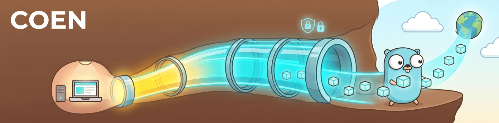
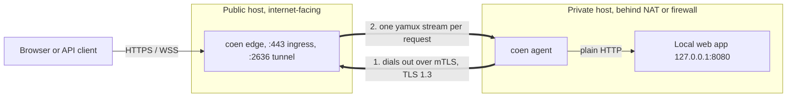
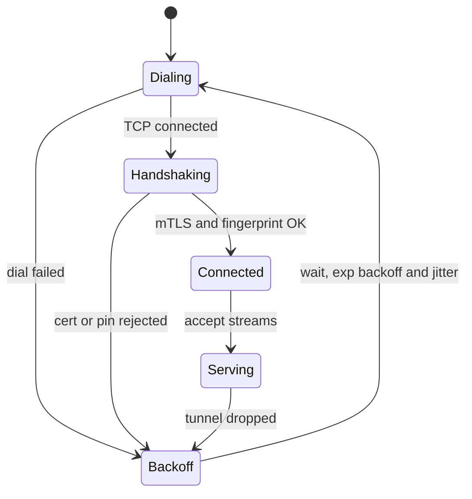
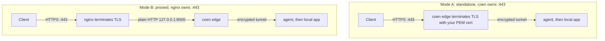

# Coen

[](https://github.com/baspeters/coen/actions/workflows/ci.yml)
[](https://github.com/baspeters/coen/actions/workflows/codeql.yml)
[](https://codecov.io/gh/baspeters/coen)
[](https://github.com/baspeters/coen/releases/latest)
[](https://pkg.go.dev/github.com/baspeters/coen)
[](LICENSE)


Coen is a small, self-hosted tunnel. It publishes a private web service to the internet over
a single, always-on, mutually authenticated connection. It covers the same ground as
Cloudflare Tunnel or ngrok, except you run both ends and nothing sits between your traffic
and your two machines.

> Status: this is an MVP. The tunnel core (mTLS transport, HTTP and WebSocket forwarding,
> reconnect, diagnostics) is implemented and covered by unit and end-to-end tests. Some
> production hardening (public-listener limits, graceful in-flight draining, metrics,
> multi-route) is still on the [roadmap](#roadmap). Read the [security model](#security-model)
> before you expose an edge to the public internet.

## Table of contents

- [Why Coen](#why-coen)
- [Features](#features)
- [How it works](#how-it-works)
- [Key concepts](#key-concepts)
- [Installation](#installation)
- [Quick start](#quick-start)
- [Deployment modes](#deployment-modes)
- [Command overview](#command-overview)
- [Configuration reference](#configuration-reference)
- [Security model](#security-model)
- [Observability and diagnostics](#observability-and-diagnostics)
- [Running as a systemd service](#running-as-a-systemd-service)
- [Roadmap](#roadmap)
- [Contributing](#contributing)
- [Reporting bugs and security issues](#reporting-bugs-and-security-issues)
- [Project layout](#project-layout)
- [FAQ](#faq)
- [The name](#the-name)
- [Acknowledgements](#acknowledgements)
- [License](#license)

## Why Coen

Suppose you run a web app, an API, or a dashboard on a machine that the internet cannot reach:
it lives behind NAT, a home router, a company firewall, or a cloud security group with no
inbound rules. You want to serve it publicly over HTTPS without opening inbound ports or
handing your traffic to someone else's service.

Coen does this with two small binaries:

- An agent on the private machine dials out to a public edge that you control, and keeps one
  encrypted connection open. If it drops, the agent reconnects on its own.
- The edge, on an internet-facing host you own, accepts public HTTPS and WebSocket traffic and
  sends each request back down the tunnel to the agent, which hands it to your local service.

The private side never listens on a public port. There is no shared secret in any config
file, and no third party in the data path.

## Features

- Mutual authentication. The tunnel is TLS 1.3 with client-certificate auth and an Ed25519
  CA. You add or remove an agent by issuing or revoking a certificate; there is no shared
  password to leak.
- HTTPS and WebSocket. The edge forwards raw byte streams, so `Upgrade` handshakes and
  long-lived connections pass through without special handling.
- Two ingress modes. The edge can terminate TLS itself with your PEM certificate, or run
  behind an existing nginx vhost as a plain-HTTP upstream.
- Automatic reconnect. The agent retries with exponential backoff and jitter; yamux
  keepalives notice dead peers behind NAT.
- Diagnostics that actually help. Named connectivity events in the logs, a `conn_id` that ties
  a single request together across both processes, a `coen doctor` preflight, and a live
  `coen status` socket.
- Simple to operate. One binary with subcommands, YAML config, and a `coen install` that
  writes hardened systemd units.
- Small footprint. Pure Go with three third-party dependencies (`cobra`, `yamux`, `yaml.v3`);
  everything else is the standard library.

## How it works



Only the agent opens a connection. The edge never needs a route into the private network,
which is what lets Coen work from behind NAT without any inbound ports.

## Key concepts

- Edge: the public `coen edge` process. It terminates (or, behind nginx, receives) public
  traffic and multiplexes it down the tunnel.
- Agent: the private `coen agent` process. It dials the edge, authenticates, and bridges each
  stream to your local service.
- Tunnel: one persistent mTLS connection on port `2636`, which is `COEN` on a phone keypad. It
  carries many multiplexed [yamux](https://github.com/hashicorp/yamux) streams.
- Stream and preamble: every public connection becomes one stream, prefixed with a short
  preamble that carries a `conn_id` and the original client address so a request can be traced
  from end to end.

### Request data flow


### Agent connection lifecycle

The agent runs a connect and reconnect loop, so a dropped tunnel always recovers.



### Ingress modes



## Installation

Coen is a single static binary. The daemons target Linux (systemd); the CLI and the
`coen cert` tooling run anywhere Go does.

### From a release (prebuilt binary)

Download the archive for your OS and architecture from the
[latest release](https://github.com/baspeters/coen/releases/latest). Assets are named
`coen_<version>_<os>_<arch>.tar.gz` (linux/darwin, amd64/arm64), with a `checksums.txt`
alongside for verification. Extract and put `coen` on your PATH:

```bash
tar -xzf coen_*_linux_amd64.tar.gz coen
sudo install coen /usr/local/bin/coen
coen version
```

### Linux packages (.deb, .rpm, .apk)

Every release also ships native packages for amd64 and arm64. They install the
binary to `/usr/bin/coen`, add systemd units for both roles under
`/usr/lib/systemd/system`, create a dedicated `coen` service user, and lay down
example configs in `/etc/coen` (preserved across upgrades). Download the file
for your distribution from the
[latest release](https://github.com/baspeters/coen/releases/latest):

```bash
# Debian, Ubuntu
sudo dpkg -i coen_*_linux_amd64.deb

# Fedora, RHEL, openSUSE
sudo rpm -i coen_*_linux_amd64.rpm

# Alpine
sudo apk add --allow-untrusted coen_*_linux_amd64.apk
```

The services are installed but not started. Edit the config for your role, put
the certificates under `/etc/coen` (see [Quick start](#quick-start)), then
enable the unit:

```bash
sudo systemctl enable --now coen-edge     # or coen-agent
```

### With `go install`

Requires Go 1.25 or newer:

```bash
go install github.com/baspeters/coen/cmd/coen@latest
```

### From source

```bash
git clone https://github.com/baspeters/coen
cd coen
make build          # produces ./bin/coen
make build-linux    # produces ./bin/coen-linux-amd64 for the server
```

## Quick start

The steps below run a full trial on one machine, with the edge, agent, and a backend all on
`127.0.0.1`. A two-host deployment is the same; only the addresses and the certificate host
change.

First, build and create the PKI. One command creates the CA, two more issue the edge and agent
certificates from it.

```bash
make build
./bin/coen cert init  --dir ./pki
./bin/coen cert edge  --dir ./pki --host 127.0.0.1     # use your public FQDN in production
./bin/coen cert agent --dir ./pki --name my-agent
```

Next, write two config files.

```yaml
# edge.yaml, the public side. Proxied mode takes plain HTTP, so no PEM is needed here.
ingress:
  mode: proxied
  listen: 127.0.0.1:8000
tunnel:
  listen: 127.0.0.1:2636
  ca:   ./pki/ca.crt
  cert: ./pki/edge.crt
  key:  ./pki/edge.key
admin:
  socket: /tmp/coen-edge.sock
```

```yaml
# agent.yaml, the private side.
edge:
  address: 127.0.0.1:2636
  ca:   ./pki/ca.crt
  cert: ./pki/agent.crt
  key:  ./pki/agent.key
service:
  address: 127.0.0.1:9000     # your local app
admin:
  socket: /tmp/coen-agent.sock
```

Start a backend, the edge, and the agent, either in three terminals or in the background.

```bash
python3 -m http.server 9000            # stand-in for your private app
./bin/coen edge  --config edge.yaml
./bin/coen agent --config agent.yaml
```

Check the tunnel and send a request through it.

```bash
./bin/coen status --socket /tmp/coen-edge.sock     # reports tunnel: true
curl http://127.0.0.1:8000/                        # served by :9000, through the tunnel
```

Before going live, run the preflight on each host. It checks certificates, expiry, DNS, port
reachability, a live mTLS handshake, and clock skew.

```bash
coen doctor --role edge  --config /etc/coen/edge.yaml
coen doctor --role agent --config /etc/coen/agent.yaml
```

## Deployment modes

The tunnel side is identical either way. What changes is how the edge takes in public traffic.

### Mode A: standalone, Coen terminates TLS

Set `ingress.mode: standalone`, bind `:443`, and point Coen at your PEM certificate.

```yaml
ingress:
  mode: standalone
  listen: ":443"
  tls:
    cert: /etc/coen/certs/public.crt   # for example, from Let's Encrypt or certbot
    key:  /etc/coen/certs/public.key
```

### Mode B: behind nginx, nginx terminates TLS

Set `ingress.mode: proxied` and `ingress.listen: 127.0.0.1:8000`. nginx keeps `:443` and its
certificate. Add the snippet from [`packaging/nginx/coen.conf`](packaging/nginx/coen.conf) to
your vhost. It includes the `map` block that WebSocket upgrades need.

```nginx
map $http_upgrade $connection_upgrade { default upgrade; '' close; }

location / {
    proxy_pass http://127.0.0.1:8000;   # coen edge in proxied mode
    proxy_http_version 1.1;
    proxy_set_header Upgrade $http_upgrade;
    proxy_set_header Connection $connection_upgrade;
    proxy_set_header Host $host;
}
```

Only the tunnel port (`2636`) needs to be reachable by the agent. nginx keeps `:443`, and the
mTLS tunnel stays end to end, since nginx never sees the tunnel's certificates.

## Command overview

Everything lives under one binary, invoked as `coen <command>`.

| Command | What it does |
| --- | --- |
| `coen edge` | Run the public edge (ingress plus the mTLS tunnel server). |
| `coen agent` | Run the private agent (dials the edge, forwards to a local service). |
| `coen cert init` | Create a new Coen CA (`ca.crt`, `ca.key`). |
| `coen cert edge` | Issue the edge (server) certificate, signed by the CA. |
| `coen cert agent` | Issue an agent (client) certificate. |
| `coen doctor` | Role-aware preflight checks with pass/fail results and remediation hints. |
| `coen status` | Live snapshot from a running daemon over its admin socket. |
| `coen install` | Write a hardened systemd unit and an example config for a role. |
| `coen version` | Print the version. |

Flags and examples:

```bash
# PKI. Default --dir is /etc/coen/pki; --force overwrites an existing CA.
coen cert init  --dir /etc/coen/pki
coen cert edge  --dir /etc/coen/pki --host edge.example.com   # FQDN or IP goes into the cert SAN
coen cert agent --dir /etc/coen/pki --name laptop-agent       # --name becomes the certificate CN

# Daemons. Default --config is /etc/coen/<role>.yaml.
coen edge  --config /etc/coen/edge.yaml
coen agent --config /etc/coen/agent.yaml

# Diagnostics.
coen doctor --role edge  --config /etc/coen/edge.yaml         # exits non-zero if any check fails
coen status --socket /run/coen/edge.sock                      # add --json for scripts

# Packaging.
coen install edge  --unit-dir /etc/systemd/system --config-dir /etc/coen --bin /usr/local/bin/coen
```

Sending `SIGHUP`, or running `systemctl reload`, re-reads a running daemon's config and
re-applies its log level without a restart.

## Configuration reference

Config is YAML, one file per role. Defaults are `/etc/coen/edge.yaml` and
`/etc/coen/agent.yaml`, overridable with `--config`. Files are validated at startup with clear
error messages.

`edge.yaml`:

```yaml
ingress:
  mode: standalone          # standalone or proxied
  listen: ":443"            # standalone; use "127.0.0.1:8000" behind nginx
  tls:                      # ignored in proxied mode, where nginx owns the cert
    cert: /etc/coen/certs/public.crt
    key:  /etc/coen/certs/public.key
tunnel:
  listen: ":2636"           # mTLS server the agent dials
  ca:   /etc/coen/pki/ca.crt
  cert: /etc/coen/pki/edge.crt
  key:  /etc/coen/pki/edge.key
  # allowed_agent_fingerprints: ["SHA256:..."]   # optional allow-list
log:
  level: info               # trace, debug, info, warn, or error
  format: text              # text or json
admin:
  socket: /run/coen/edge.sock
```

`agent.yaml`:

```yaml
edge:
  address: edge.example.com:2636
  ca:   /etc/coen/pki/ca.crt
  cert: /etc/coen/pki/agent.crt
  key:  /etc/coen/pki/agent.key
  # edge_fingerprint: "SHA256:..."               # optional certificate pinning
service:
  address: 127.0.0.1:8080   # the local app to expose
reconnect:
  min_backoff: 1s
  max_backoff: 30s
log:
  level: info
  format: text
admin:
  socket: /run/coen/agent.sock
```

## Security model

The tunnel uses TLS 1.3 with mutual certificate authentication (`RequireAndVerifyClientCert`)
and an Ed25519 CA. The edge accepts only agents whose client certificate chains to the trusted
CA, and the agent trusts only an edge whose server certificate does the same. No config file
holds a shared symmetric secret. To add an agent, issue a certificate; to remove one, revoke
or delete it.

For defence in depth beyond CA trust, the agent can pin the edge's fingerprint
(`edge_fingerprint`) and the edge can restrict connections to a set of
`allowed_agent_fingerprints`.

The systemd units ship with least privilege in mind. They run as a non-root `coen` user with
`NoNewPrivileges`, `ProtectSystem=strict`, and a scoped `ReadWritePaths`. A standalone edge
that binds `:443` gets exactly `CAP_NET_BIND_SERVICE`, not full root.

Known limits for this MVP: the tunnel port enforces a TLS-handshake deadline, but ingress
idle-deadlines, connection caps, and bounded in-flight draining on shutdown are on the
[roadmap](#roadmap). In a proxied deployment, nginx fronts the ingress and handles slow-client
protection. Treat internet-exposed use as beta, and where you can, firewall the tunnel port to
known sources.

## Observability and diagnostics

A two-sided tunnel is awkward to debug, so observability is built into the core rather than
bolted on.

Logging uses `log/slog` in text or JSON. Each step is a named event, for example `edge.dial`,
`tunnel.tls_handshake`, `tunnel.established`, `agent.connected`, `ingress.accept`,
`stream.open`, `stream.closed`, and `reconnect.scheduled`, with timing and the concrete reason
on failure.

Because every request carries a `conn_id` in its stream preamble, the same id shows up in both
the edge and agent logs. Running `grep <conn_id>` on either host reconstructs one request's
whole lifecycle.

`coen status` returns a live snapshot over a local Unix socket: whether the tunnel is up and
since when, active and total streams, bytes in and out, reconnect count, last error, and the
peer fingerprint. Add `--json` for scripts.

`coen doctor` runs the role-aware preflight described above and exits non-zero if anything
fails, so it fits into deploy scripts. The log level can be changed on a running daemon with
`systemctl reload` or `SIGHUP`, without dropping the tunnel.

## Running as a systemd service

`coen install` writes a hardened unit and an example config for each role.

```bash
sudo coen install edge     # writes /etc/systemd/system/coen-edge.service and /etc/coen/edge.yaml
sudo coen install agent    # writes /etc/systemd/system/coen-agent.service and /etc/coen/agent.yaml

# Edit the configs, put your PKI under /etc/coen/pki, then enable the service.
sudo systemctl enable --now coen-edge      # on the public host
sudo systemctl enable --now coen-agent     # on the private host
```

## Roadmap

These are deliberately out of scope for the MVP. The architecture leaves room for them.

- [ ] Multi-route and multiple hostnames (host-based routing at the edge)
- [ ] ACME and Let's Encrypt automatic certificates for standalone mode
- [ ] Prometheus `/metrics` endpoint (the counters are already tracked internally)
- [ ] Public-listener hardening: ingress idle-deadlines, connection caps, lazy backend dial
- [ ] Bounded graceful draining of in-flight streams on shutdown
- [ ] Tunnelling over `:443` (nginx `stream` with `ssl_preread`, or a WebSocket transport)
- [ ] Multiple concurrent agents and load balancing; certificate rotation and revocation
- [ ] QUIC and HTTP/3 transport option

## Contributing

Contributions are welcome, whether it is a bug fix, a roadmap item, docs, or tests.

1. For anything non-trivial, open an issue first so we can agree on the approach before you
   spend time on it.
2. Fork and branch from `main`, for example `feat/multi-route` or `fix/handshake-deadline`.
3. The codebase is test-first, so add or update tests alongside your change.
4. Keep it green and tidy before opening a pull request:

   ```bash
   golangci-lint run ./...   # errcheck, staticcheck, govet, ineffassign, unused, gofmt
   go test -race ./...       # the whole suite passes under the race detector
   govulncheck ./...         # scan for known vulnerabilities
   ```

   CI runs the same checks (lint, a Go 1.25 and 1.26 test matrix under `-race`,
   and `govulncheck`) on every push and pull request.

5. Open a pull request that explains what changed and why. Keep it focused, and reference the
   issue it addresses. Conventional-commit-style messages (`feat:`, `fix:`, `docs:`) are
   appreciated.

If you are new to the code, the [project layout](#project-layout) is the fastest way in. Good
first changes include roadmap items, extra `coen doctor` checks, and wider test coverage.

## Reporting bugs and security issues

For bugs and feature requests, [open an issue](https://github.com/baspeters/coen/issues). A
minimal reproduction, your `coen version`, the relevant `coen doctor` output, and the log lines
around the failing `conn_id` make a fix much faster.

For security vulnerabilities, please do not open a public issue. Report it privately through
GitHub Security Advisories (Security, then "Report a vulnerability") so a fix can ship before
disclosure.

## Project layout

```
cmd/coen/            thin main() entrypoint
internal/
  cli/               cobra commands (edge, agent, cert, doctor, status, install, version)
  edge/              public server: ingress listeners, tunnel server, stream router
  agent/             private client: dial and reconnect, stream-to-service bridge
  tunnel/            shared mTLS config, yamux sessions, stream preamble
  proxy/             bidirectional byte-copy plumbing
  pki/               Ed25519 CA, certificate issuance, fingerprints
  config/            YAML load and validation
  obs/               slog logging, correlation IDs, live counters
  admin/             local unix-socket status and control server
  doctor/            preflight diagnostic checks
  e2e/               end-to-end tests (HTTP, WebSocket, correlation)
packaging/nginx/     example proxied-mode vhost snippet
```

## FAQ

Do I need to open inbound ports on the private machine? No. The agent only makes an outbound
connection to the edge.

Does it support WebSockets? Yes. The edge forwards raw byte streams, so `Upgrade` handshakes
and long-lived sockets pass through.

Can several agents connect to one edge? The MVP tracks a single active agent per edge.
Multi-agent support and load balancing are on the roadmap.

Where do the public TLS certificates come from? You provide them in standalone mode (for
example, Let's Encrypt), or nginx owns them in proxied mode. The Coen CA is only for the
internal tunnel, never for public traffic.

## The name

Coen is a nod to the Coentunnel, a road tunnel under the North Sea Canal in Amsterdam. It also
happens that `COEN` spells `2636` on a phone keypad, which is Coen's tunnel port. Gophers dig
tunnels; so does Coen.

## Acknowledgements

The Go gopher was created by [Renée French](https://reneefrench.blogspot.com/); the banner is
drawn in that style. Coen builds on [hashicorp/yamux](https://github.com/hashicorp/yamux) for
stream multiplexing and [spf13/cobra](https://github.com/spf13/cobra) for the CLI.

## License

Coen is released under the [MIT License](LICENSE).
